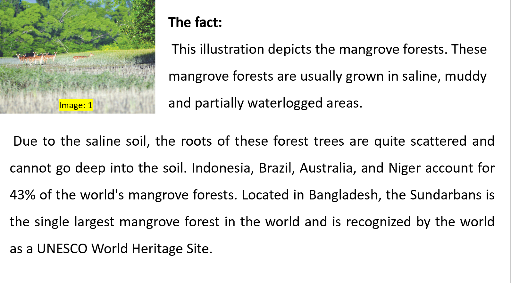
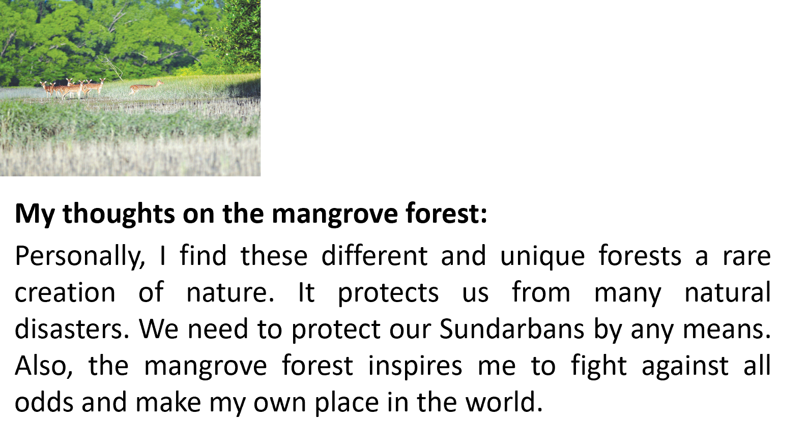

| ইংরেজি শব্দ  | অর্থ           | উচ্চারণ                       |
| ------------ | -------------- | ----------------------------- |
| fact         | তথ্য           | ফ্যাক্ট (fakt)                |
| illustration | চিত্রায়ন      | ইলাস্ট্রেশন (i-laa-stre-shan) |
| depicts      | চিত্রায়িত করা | ডিপিক্TS (di-pikts)           |
| mangrove     | গরান গাছ       | ম্যাংগ্রোভ (maNG-grohv)       |
| forests      | বন             | ফরেস্টস (fo-rests)            |
| usually      | সাধারণত        | ইউজুয়ালি (yu-zhu-a-li)       |
| grown        | বড় হওয়া      | গ্রোন (grohn)                 |
| saline       | লবণাক্ত        | সালাইন (saa-lain)             |
| muddy        | কার্দমাক্ত     | মাদি (maa-di)                 |
| partially    | আংশিকভাবে      | পার্শালি (paar-sha-li)        |
| waterlogged  | জলাবদ্ধ        | ওয়াটারলগড (wo-tar-lohgd)     |
| areas        | এলাকা          | এরিয়াস (e-ri-yaas)           |
| due          | কারণে          | ডিউ (diu)                     |
| soil         | মাটি           | সয়েল (soil)                  |
| roots        | মূল            | রুটস (roots) র                |
| trees        | গাছ            | ট্রিস (tris)                  |
| quite        | প্রায়         | ক্ওয়াইট (kwoit)              |
| scattered    | বিক্ষিপ্ত      | স্ক্যাটার্ড (ska-tard)        |
| deep         | গভীর           | ডিপ (dip)                     |
| account      | হিসাব , দায়ী   | অ্যাকাউন্ট (a-kaunt)          |
| located      | অবস্থিত        | লোকেটেড (loh-ke-ted)          |
| largest      | বৃহত্তম        | লার্জেস্ট (laar-jest)         |
| recognized   | স্বীকৃত        | রেকগনাইজ্ড (rek-og-naizd)     |
| heritage     | ঐতিহ্য         | হেরিটেজ (he-ri-tej)           |
| thoughts     | চিন্তা         | থটস (thots)                   |
| personally   | ব্যক্তিগতভাবে  | পার্সোনালি (paar-soh-na-li)   |
| find         | পাওয়া যায়    | ফাইন্ড (faind)                |
| different    | ভিন্ন          | ডিফারেন্ট (dif-a-rent)        |
| unique       | অনন্য          | ইউনিক (yu-nik)                |
| rare         | দুর্লভ         | রেয়ার (re-yar)               |
| creation     | সৃষ্টি         | ক্রিয়েশন (kri-ye-shan)       |
| nature       | প্রকৃতি        | নেচার (ne-char)               |
| protects     | রক্ষা করে      | প্রোটেক্টস (proh-tekts)       |
| natural      | প্রাকৃতিক      | ন্যাচুরাল (naach-ral)         |
| disasters    | দুর্যোগ        | দিজাস্টার্স (di-jaas-tarz)    |
| need         | প্রয়োজন       | নিড (nid)                     |
| protect      | রক্ষা করা      | প্রোটেক্ট (proh-tekt)         |
| any          | কোনো           | এনি (e-ni)                    |
| means        | মাধ্যম         | মিনস (minz)                   |
| also         | তদুপরি         | অল্সো (ol-soh)                |
| inspires     | অনুপ্রাণিত করে | ইনস্পায়ার্স (in-spaiz)       |
| me           | আমাকে          | মি (mi)                       |
| fight        | লড়াই করা      | ফাইট (fait)                   |
| against      | বিরুদ্ধে       | অগেনস্ট (a-genst)             |
| odds         | বিপদ           | অডস (odz)                     |
| make         | তৈরি করা       | মেক (mek)                     |
| own          | নিজের          | ওন (ohn)                      |
| place        | স্থান          | প্লেস (ples)                  |
